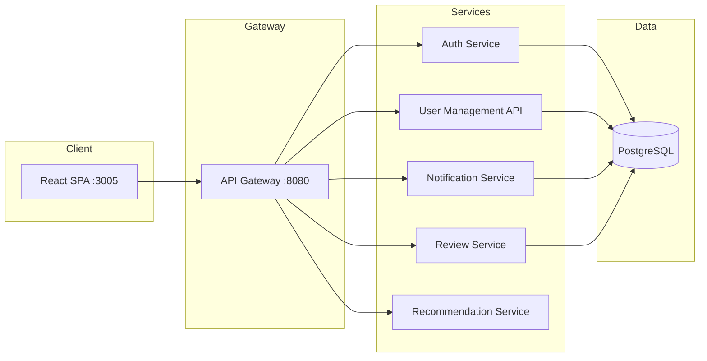

# MentorHub — Domain Class Diagram

Professional single-page class diagram for the MentorHub domain model.

## View the diagram

| Format | File |
|--------|------|
| **Interactive (recommended)** | [MentorHub-Class-Diagram.html](./MentorHub-Class-Diagram.html) — open in Chrome/Firefox, use **Print → Save as PDF** (A3 landscape) |
| **Source (Mermaid)** | Diagram source is embedded in the HTML file |

## Architecture overview

## Domain packages (logical)

| Package | Root entities | Purpose |
|---------|---------------|---------|
| **Authentication** | `User`, `Provider`, `EmailOtp` | Signup, login, JWT, OAuth |
| **Platform Identity** | `UserAccount`, `TutorProfile`, `StudentProfile` | One role at signup; profiles keyed by `authUserId` |
| **LMS Batch** | `TutorBatch`, `BatchEnrollment`, `GeneratedClassSession` | Monthly course packages & class schedule |
| **Hourly Booking** | `Booking` | One-off tutor sessions |
| **Learning** | `CourseAssignment`, `AssignmentSubmission`, `LearningGoal` | Homework, progress, attendance |
| **Engagement** | `Review`, `ChatMessage`, `Notification` | Reviews, chat, alerts |
| **Admin** | `CmsPage`, `UserWarning`, `AccountRestriction` | CMS, moderation, audit |

## Key relationships

- `User` (auth DB) syncs to `UserAccount` (platform) via `authUserId` — no dual-profile switching.
- `TutorBatch` 1→* `BatchEnrollment` ← `StudentProfile` / `TutorProfile`.
- `Booking` is separate from batch enrollment (hourly sessions only).
- `Review` links to `Booking` or `BatchEnrollment`.
- `Notification` stores `recipientAuthUserId` (cross-service, no FK to platform DB).

## Regenerate PDF

1. Open `docs/MentorHub-Class-Diagram.html` in a browser.
2. Press `Ctrl+P` / `Cmd+P`.
3. Layout: **Landscape**, paper **A3** (or fit to page).
4. Save as PDF.
